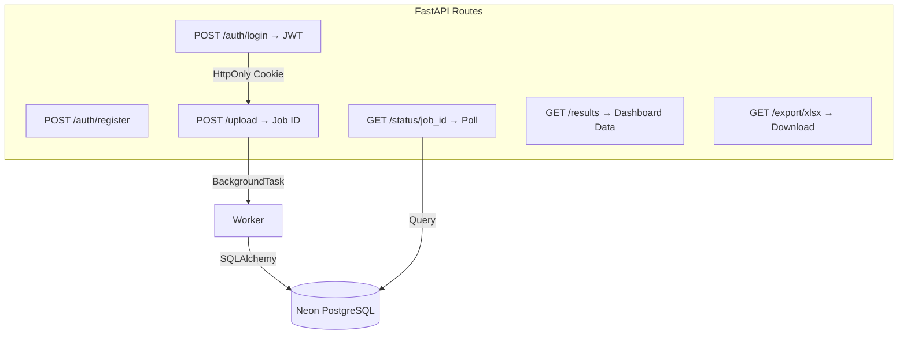
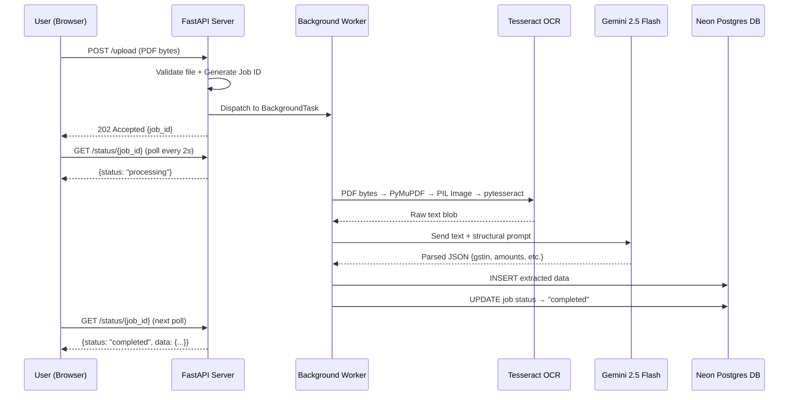
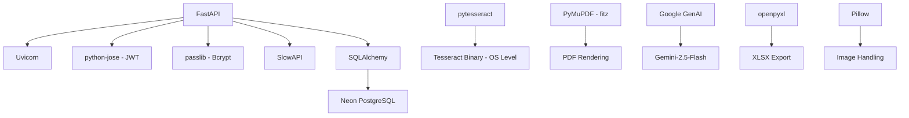

# ARCHITECTURE.md - GST Invoice Scanner

---

## Table of Contents

- [Architecture Overview](#1-architecture-overview)
- [System Components](#2-system-components)
- [Data Flow Diagram](#3-data-flow-diagram)
- [Directory ↔ Component Mapping](#4-directory--component-mapping)
- [Design Decisions & Trade-offs](#5-design-decisions--trade-offs)
- [Scalability Considerations](#6-scalability-considerations)
- [Security Considerations](#7-security-considerations)
- [Dependency Graph](#8-dependency-graph)

---

## 1. Architecture Overview

GST Invoice Scanner follows an **Event-Driven Pipeline Architecture** with asynchronous job dispatch. It is structured as a **Modular Monolith** — logically separated components deployed as a single FastAPI service.

### High-Level Flow


**Key Principle:** No step in the pipeline blocks the API thread. Upload returns a Job ID instantly; the client polls for completion.

---

## 2. System Components

### a. Input Handler

| Responsibility | Implementation |
|---|---|
| Accept PDF / JPG / PNG uploads | FastAPI `UploadFile` |
| PDF → Image conversion | PyMuPDF (`fitz`) — renders pages to PIL Images directly in RAM |
| File validation | MIME type check + extension whitelist |

> **Design Choice:** PyMuPDF maps PDF bytes to memory instead of writing temp files to disk. This eliminates disk I/O bottlenecks and temp-file cleanup risks.

---

### b. OCR Engine

| Aspect | Detail |
|---|---|
| Primary Engine | **Tesseract OCR** via `pytesseract` |
| Image Prep | PyMuPDF renders PDF pages at **300 DPI** as PIL `Image` objects |
| Output | Raw unstructured text blob |

> No separate image preprocessing module (grayscale, deskew, etc.) is currently implemented — the system relies on LLM intelligence to parse noisy OCR output directly. This is a deliberate trade-off favoring speed over traditional CV pipelines.

---

### c. NLP Intelligence Layer (Field Extractor)

This is the **core differentiator**. Instead of fragile regex chains, raw OCR text is sent to **Google Gemini 2.5 Flash** with a strict structural prompt wrapped in XML safeguards.

```
Prompt Strategy:
┌────────────────────────────────────────────┐
│ "Extract ONLY these fields from the text   │
│  inside the <raw_text> bounding tags:      │
│  seller_gstin, buyer_gstin, invoice_no,    │
│  date, taxable_amount, cgst, sgst, igst.   │
│  Return valid JSON only."                   │
└────────────────────────────────────────────┘
```

| Aspect | Detail |
|---|---|
| Provider | Google GenAI SDK |
| Model | `gemini-2.5-flash` |
| Why Gemini | Excels at JSON mapping, high rate limits, extreme token speed |
| Security | XML wrapping prevents Prompt Injection from malicious PDF payloads |

---

### d. Validation & Persistence

| Responsibility | Implementation |
|---|---|
| Data modeling | SQLAlchemy ORM models |
| Database | Neon Serverless PostgreSQL |
| Error Quarantining | `fitz.FileDataError` explicitly trapped into `status="FAILED"` |

---

### e. API Layer



| Aspect | Detail |
|---|---|
| Auth | JWT stored natively in HttpOnly/SameSite Strict Cookies |
| Rate Limiting | SlowAPI middleware |
| Async Workers | FastAPI `BackgroundTasks` |

---

### f. UI Layer

| Aspect | Detail |
|---|---|
| Technology | Vanilla JS + HTML5 + CSS3 Grid |
| Pages | `login.html`, `register.html`, `dashboard.html` |
| Polling | `setInterval()` at 2-second intervals checking `/status/{job_id}` |
| Export | Client-triggered download of XLSX from `/export` endpoint |

---

## 3. Data Flow Diagram



---

## 4. Directory ↔ Component Mapping

| Directory / File | Architectural Component |
|---|---|
| `backend/` | API Layer, Workers, Business Logic |
| `backend/run.py` | Application entry point |
| `backend/routes/` | FastAPI route definitions (auth, upload, results) |
| `backend/models/` | SQLAlchemy ORM models |
| `backend/services/` | OCR + LLM extraction logic |
| `backend/auth/` | JWT generation, password hashing |
| `backend/.env` | Secrets (Groq key, JWT secret) |
| `frontend/` | UI Layer |
| `frontend/login.html` | Authentication page |
| `frontend/dashboard.html` | Upload + results + export page |
| `frontend/js/` | Polling logic, API calls, DOM rendering |
| `requirements.txt` | Dependency manifest |

---

## 5. Design Decisions & Trade-offs

| Decision | Chosen | Alternative | Rationale |
|---|---|---|---|
| **Field Extraction** | LLM (Google Gemini 2.5 Flash) | Regex + NLP pipeline | Invoices have wildly varying formats — regex breaks on edge cases; LLM generalizes across layouts. Gemini 2.5 Flash chosen for JSON determinism, high rate limits, and low latency |
| **OCR Engine** | Tesseract | EasyOCR / PaddleOCR | Lightest installation footprint; sufficient since LLM handles noisy text |
| **Image Preprocessing** | Skipped | OpenCV pipeline | LLM compensates for OCR noise — adding CV preprocessing would increase latency without proportional accuracy gain |
| **Async Strategy** | FastAPI BackgroundTasks | Celery + Redis | Avoids infrastructure overhead for a single-server deployment; Celery is overkill at current scale |
| **PDF Handling** | PyMuPDF (in-memory) | pdf2image + Poppler | Zero disk writes — PDF bytes → RAM → PIL Image directly |
| **Frontend** | Vanilla JS | React / Streamlit | Zero build step, no node_modules, instant load — appropriate for a utility dashboard |
| **Error Handling** | Job status set to `failed` + error message stored in DB | Raise HTTP exceptions | Non-blocking — user sees failure on next poll without crashing the worker queue |

---

## 6. Scalability Considerations

| Concern | Current | Future Path |
|---|---|---|
| **Concurrent uploads** | Single-threaded BackgroundTasks | Migrate to **Celery + Redis** worker pool |
| **Database** | SQLite (single-writer lock) | Swap to **PostgreSQL** via `DATABASE_URL` env change |
| **OCR throughput** | Sequential per job | Parallelize multi-page PDFs across threads |
| **LLM rate limits** | Single Groq API key | Key rotation pool + retry with exponential backoff |
| **Horizontal scaling** | Single instance | Containerize (Docker) → deploy behind load balancer |

---

## 7. Security Considerations

| Layer | Measure |
|---|---|
| **Authentication** | Bcrypt-hashed passwords + JWT access tokens with expiry |
| **Rate Limiting** | SlowAPI middleware prevents brute-force and upload abuse |
| **File Validation** | MIME type + extension whitelist (PDF/JPG/PNG only) |
| **Data Privacy** | Invoice bytes are processed in-memory and **never written to disk** |
| **Secret Management** | API keys and JWT secrets isolated in `.env` (gitignored) |
| **Input Sanitization** | LLM prompt is hardcoded — user-uploaded text is treated as data, not instruction |

---

## 8. Dependency Graph



| Dependency | Role |
|---|---|
| `fastapi` + `uvicorn` | HTTP server and ASGI runtime |
| `pytesseract` | Python wrapper for Tesseract OCR binary |
| `PyMuPDF (fitz)` | In-memory PDF → Image conversion |
| `Pillow` | Image object handling between PyMuPDF and Tesseract |
| `google-genai` | SDK for Google Gemini LLM inference |
| `sqlalchemy` | ORM for database operations |
| `python-jose` | JWT token creation and verification |
| `passlib[bcrypt]` | Secure password hashing |
| `slowapi` | Rate limiting middleware |
| `openpyxl` | Excel file generation for data export |

---

<p align="center"><i>Architecture authored for <a href="https://github.com/VRCHAMPION/gst_invoice_scanner">gst_invoice_scanner</a></i></p>
