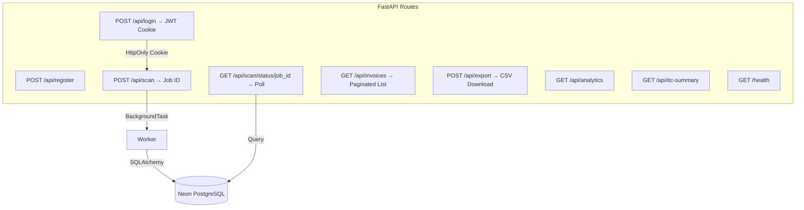
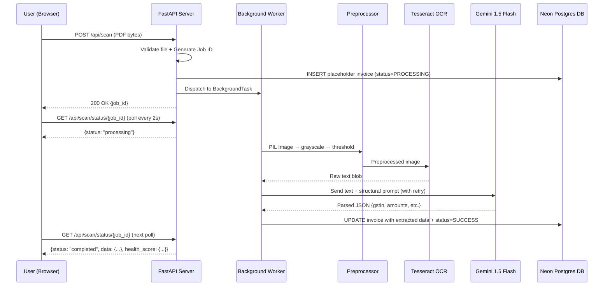
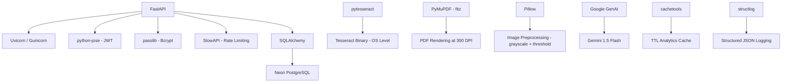

# ARCHITECTURE.md — GST Invoice Scanner

---

## Table of Contents

- [Architecture Overview](#1-architecture-overview)
- [System Components](#2-system-components)
- [Data Flow Diagram](#3-data-flow-diagram)
- [Directory ↔ Component Mapping](#4-directory--component-mapping)
- [Design Decisions & Trade-offs](#5-design-decisions--trade-offs)
- [Scalability Considerations](#6-scalability-considerations)
- [Security Considerations](#7-security-considerations)
- [Dependency Graph](#8-dependency-graph)

---

## 1. Architecture Overview

GST Invoice Scanner follows an **Event-Driven Pipeline Architecture** with asynchronous job dispatch. It is structured as a **Modular Monolith** — logically separated components deployed as a single FastAPI service.

### High-Level Flow


**Key Principle:** No step in the pipeline blocks the API thread. Upload returns a Job ID instantly; the client polls for completion.

---

## 2. System Components

### a. Input Handler

| Responsibility | Implementation |
|---|---|
| Accept PDF / JPG / PNG uploads | FastAPI `UploadFile` |
| PDF → Image conversion | PyMuPDF (`fitz`) — renders pages to PIL Images directly in RAM at 300 DPI |
| File validation | MIME type check + extension whitelist |

> **Design Choice:** PyMuPDF maps PDF bytes to memory instead of writing temp files to disk. This eliminates disk I/O bottlenecks and temp-file cleanup risks.

---

### b. OCR Engine

| Aspect | Detail |
|---|---|
| Primary Engine | **Tesseract OCR** via `pytesseract` |
| Image Preprocessing | Grayscale conversion → autocontrast → sharpen → binary threshold (Otsu-style via Pillow) |
| Output | Raw unstructured text blob |

> Image preprocessing (grayscale + binary threshold) is applied before Tesseract to improve accuracy on scanned/photographed invoices.

---

### c. NLP Intelligence Layer (Field Extractor)

This is the **core differentiator**. Instead of fragile regex chains, raw OCR text is sent to **Google Gemini 1.5 Flash** with a strict structural prompt wrapped in XML safeguards.

```
Prompt Strategy:
┌────────────────────────────────────────────┐
│ "Extract ONLY these fields from the text   │
│  inside the <raw_text> bounding tags:      │
│  seller_gstin, buyer_gstin, invoice_no,    │
│  date, taxable_amount, cgst, sgst, igst.   │
│  Return valid JSON only."                   │
└────────────────────────────────────────────┘
```

| Aspect | Detail |
|---|---|
| Provider | Google GenAI SDK |
| Model | `gemini-1.5-flash` |
| Retry | Exponential backoff — 3 attempts, delays 2s / 4s / 8s on 429/503 |
| Security | XML wrapping prevents Prompt Injection from malicious PDF payloads |

---

### d. Validation & Persistence

| Responsibility | Implementation |
|---|---|
| Data modeling | SQLAlchemy ORM models (`models.py`) |
| Database | Neon Serverless PostgreSQL |
| Error Quarantining | `fitz.FileDataError` explicitly trapped into `status="FAILED"` |
| Composite indexes | `(company_id, status)` and `(company_id, created_at)` for analytics performance |

---

### e. API Layer



| Aspect | Detail |
|---|---|
| Auth | JWT stored in HttpOnly/SameSite cookies; `secure=True` in production |
| Rate Limiting | SlowAPI: 5/min on login/register, 10/min on scan |
| Async Workers | FastAPI `BackgroundTasks` (Celery migration path documented) |
| Response Models | All endpoints use explicit Pydantic `response_model=` |
| Pagination | `GET /api/invoices?page=1&limit=50` |
| Caching | TTLCache (5-min) on analytics and ITC summary, keyed by company_id |

---

### f. UI Layer

| Aspect | Detail |
|---|---|
| Technology | Vanilla JS + HTML5 + CSS3 Grid |
| Pages | `login.html`, `register.html`, `upload.html`, `results.html`, `analytics.html`, `history.html` |
| Polling | `setInterval()` at 2-second intervals, max 60 attempts (2-minute timeout) |
| Export | Client-triggered CSV download via `POST /api/export` |
| Shared Utilities | `utils.js` — `formatCurrency`, `formatDate`, `animateCounter` |

---

## 3. Data Flow Diagram



---

## 4. Directory ↔ Component Mapping

| Directory / File | Architectural Component |
|---|---|
| `backend/main.py` | App factory — middleware, router registration, startup hooks |
| `backend/run.py` | Development entry point (reload gated on ENV=development) |
| `backend/auth.py` | JWT creation/verification, password hashing, RBAC dependency |
| `backend/schemas.py` | All Pydantic request + response models |
| `backend/models.py` | SQLAlchemy ORM models with composite indexes |
| `backend/database.py` | Engine, session factory, `ping_db()`, `init_db()` |
| `backend/validator.py` | GSTIN validation, math checks, fraud signals, health score |
| `backend/parser.py` | OCR pipeline: PyMuPDF → Pillow preprocessing → Tesseract → Gemini |
| `backend/routers/auth.py` | Login, register, logout, /me routes |
| `backend/routers/companies.py` | Company CRUD, join requests, invite user |
| `backend/routers/invoices.py` | Scan upload, status poll, paginated list, CSV export |
| `backend/routers/analytics.py` | Analytics aggregations, ITC summary (TTL cached) |
| `backend/services/invoice_service.py` | Background invoice processing logic |
| `backend/tests/` | pytest suite — unit + integration tests |
| `frontend/js/config.js` | API base URL, `apiFetch` wrapper |
| `frontend/js/utils.js` | Shared utilities: formatCurrency, formatDate, animateCounter |
| `frontend/js/auth.js` | Auth state management, login/register/logout |
| `frontend/js/upload.js` | File upload, polling with 2-minute timeout |
| `frontend/js/results.js` | Scan result display, CSV export trigger |
| `frontend/js/analytics.js` | Charts, ITC summary, team management |
| `.github/workflows/ci.yml` | CI: lint (ruff) + pytest on push/PR |
| `Dockerfile` | Production container with HEALTHCHECK |
| `render.yaml` | Render deployment config |

---

## 5. Design Decisions & Trade-offs

| Decision | Chosen | Alternative | Rationale |
|---|---|---|---|
| **Field Extraction** | LLM (Gemini 1.5 Flash) | Regex + NLP pipeline | Invoices have wildly varying formats — LLM generalizes across layouts |
| **OCR Engine** | Tesseract + Pillow preprocessing | EasyOCR / PaddleOCR | Lightest footprint; preprocessing compensates for noise |
| **Async Strategy** | FastAPI BackgroundTasks | Celery + Redis | Avoids infrastructure overhead at current scale; Celery is the documented migration path |
| **PDF Handling** | PyMuPDF (in-memory, 300 DPI) | pdf2image + Poppler | Zero disk writes — PDF bytes → RAM → PIL Image directly |
| **Frontend** | Vanilla JS | React / Streamlit | Zero build step, no node_modules, instant load |
| **Error Handling** | Job status set to `FAILED` + error stored in DB | Raise HTTP exceptions | Non-blocking — user sees failure on next poll without crashing the worker |
| **Cookie Security** | `secure=True`, `samesite=none` in production | Bearer tokens | HttpOnly prevents XSS token theft; `samesite=none` required for cross-origin Netlify+Render |

---

## 6. Scalability Considerations

| Concern | Current | Future Path |
|---|---|---|
| **Concurrent uploads** | FastAPI BackgroundTasks (thread pool) | Migrate to **Celery + Redis** worker pool |
| **Analytics queries** | TTLCache (5-min, in-process) | Redis distributed cache |
| **OCR throughput** | Sequential per job | Parallelize multi-page PDFs across threads |
| **LLM rate limits** | Exponential backoff retry (3 attempts) | Key rotation pool |
| **Horizontal scaling** | Stateless — DB-backed job state, no in-memory dicts | Already containerized → deploy behind load balancer |
| **Invoice list** | Paginated (default 50, max 200) | Cursor-based pagination for very large datasets |

---

## 7. Security Considerations

| Layer | Measure |
|---|---|
| **Authentication** | Bcrypt-hashed passwords + JWT access tokens (8h expiry) |
| **Cookie Security** | `httponly=True`, `secure=True` (production), `samesite=none` (cross-origin) |
| **Rate Limiting** | 5/min on login/register; 10/min on scan |
| **Input Validation** | Pydantic: EmailStr, min/max lengths, GSTIN regex validator |
| **Role Hardcoding** | Self-registration always sets `role='owner'` server-side |
| **File Validation** | MIME type + extension whitelist (PDF/JPG/PNG only) |
| **Data Privacy** | Invoice bytes processed in-memory, never written to disk |
| **Secret Management** | API keys and JWT secrets in `.env` (gitignored); validated at startup |
| **Prompt Injection** | LLM prompt uses XML `<raw_text>` boundary tags to isolate user content |
| **Response Safety** | `password_hash` never returned in any API response |

---

## 8. Dependency Graph



| Dependency | Role |
|---|---|
| `fastapi` + `uvicorn` | HTTP server and ASGI runtime |
| `pytesseract` | Python wrapper for Tesseract OCR binary |
| `PyMuPDF (fitz)` | In-memory PDF → Image conversion at 300 DPI |
| `Pillow` | Image preprocessing (grayscale, threshold) + PyMuPDF bridge |
| `google-genai` | SDK for Google Gemini LLM inference |
| `sqlalchemy` | ORM for database operations |
| `python-jose` | JWT token creation and verification |
| `passlib[bcrypt]` | Secure password hashing |
| `slowapi` | Rate limiting middleware |
| `cachetools` | In-process TTL cache for analytics endpoints |
| `structlog` | Structured JSON logging with request ID context |
| `email-validator` | Pydantic EmailStr validation |

---

<p align="center"><i>Architecture for <a href="https://github.com/VRCHAMPION/gst_invoice_scanner">gst_invoice_scanner</a> — last updated after full audit refactor</i></p>
