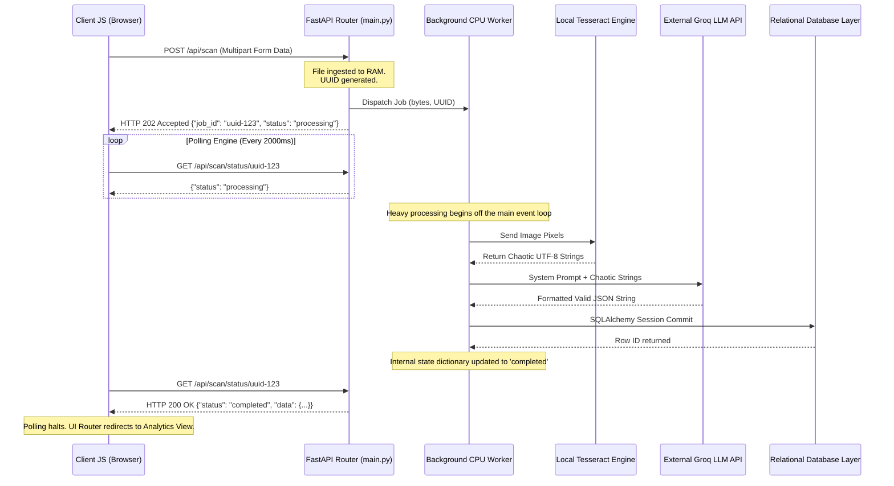

# System Architecture (The Async MVP) 🏗️

This comprehensive document delineates the high-level system architecture and infrastructural blueprint of the GST Invoice Scanner, specifically detailing the evolution toward a highly concurrent, asynchronous processing model required for production deployments.

---

## The Core Bottleneck: Synchronous Blocking

In its initial hackathon iteration, the application utilized a **Synchronous Blocking Architecture**. 
When a client (User A) initiated a `POST /scan` request uploading a heavy 5MB PDF, the FastAPI server thread would lock. The single thread would spend ~5 seconds performing PDF rendering, localized OCR, and external API requests. 
**The Catastrophic Failure:** If User B attempted to merely load the dashboard or log in during those 5 seconds, User B's request would completely hang, waiting in the network queue until User A's invoice was processed. This standard synchronous approach scales horribly, offering zero concurrency and guaranteeing server timeouts under moderate traffic.

---

## The Solution: Event-Driven Asynchronous Blueprint

We restructured the platform utilizing non-blocking I/O and background workers, achieving immense concurrent throughput capabilities.

---

## Technical Deep Dive: Architectural Design Choices

### 1. In-Memory Job State Orchestration
To track the real-time status of asynchronously dispatched background tasks, the system currently utilizes a localized Python dictionary variable (`scan_jobs = {}`) instantiated globally within the FastAPI runtime memory space. When a task completes, the worker updates this dictionary key.
- **The Advantages:** Infinite developer velocity. It requires entirely zero external infrastructural dependencies (like bootstrapping Redis containers), making it exceptionally lean, blazing fast, and optimal for immediate MVP deployment.
- **The Production Tradeoff:** This is volatile memory constraint. If the Uvicorn/FastAPI server crashes or restarts, all currently queued and explicitly processing jobs are permanently obliterated, resulting in stranded frontend clients endless polling.
- **The Scalability Roadmap:** For enterprise-grade scaling (Series A expansion), the `scan_jobs` dictionary is designed to be seamlessly swapped with a **Celery Distributed Task Queue** backed by a **Redis In-Memory Data Store**, allowing absolute persistence across multiple horizontal server nodes.

### 2. File Handling and Zero-Disk Virtualization
Traditionally, web applications persist uploaded files to a temporary `.tmp/` or `/var/uploads/` directory on the physical disk before passing the filesystem path to the processing engine. 
- **The Upgrade:** We eliminated Disk I/O bottlenecks. Uploaded files are streamed immediately via `await file.read()` into contiguous RAM bytes. These byte streams are passed directly through the PyMuPDF rendering engine and Tesseract pipeline. 
- **The Result:** We completely sidestep the latency of HDD/SSD write operations. Furthermore, this ensures optimal security and hygiene; servers never become bloated with orphaned temporary files requiring complex Cron jobs to purge.

### 3. Database Layer Independence & Abstraction
The application persistence layer is architected entirely upon the **SQLAlchemy Object-Relational Mapper (ORM)**. Data schemas are defined as Python classes rather than raw SQL dialects.
- **The Current State:** Operating on SQLite (`sqlite:///...`), allowing effortless local development without firing up Docker databases.
- **The Scalability Roadmap:** Because we utilize the ORM, the application logic is completely dialect-agnostic. Migrating this application to a high-availability, clustered **PostgreSQL** instance on AWS RDS or Supabase requires zero code rewrites. The system scales from a 1MB local file to a billion-row data center simply by altering the `DATABASE_URL` string inside the `.env` file environment variables.

### 4. API Hardening & Security Middleware
To defend the backend endpoints from malicious actors, the architecture implements dual-layer perimeter security:
- **CORS (Cross-Origin Resource Sharing) Policies:** Rigidly defined origins in FastAPI middleware deny unauthorized domains from executing AJAX requests against the API infrastructure, effectively neutralizing CSRF vulnerabilities.
- **SlowAPI Rate Limiting:** We mitigate localized DDoS attacks and protect our external API budget (Groq LPU costs) by enforcing strict throttling utilizing IP-address-based limiters (e.g., locking routes if exceeding 10 scans per 60 seconds).
- **Stateless Verification:** All secured routes sit behind FastAPI Dependency Injectors that intercept requests, decrypt the provided Bearer JSON Web Token (JWT) locally (without pinging the database), and cryptographically verify user authenticity in sub-milliseconds.
