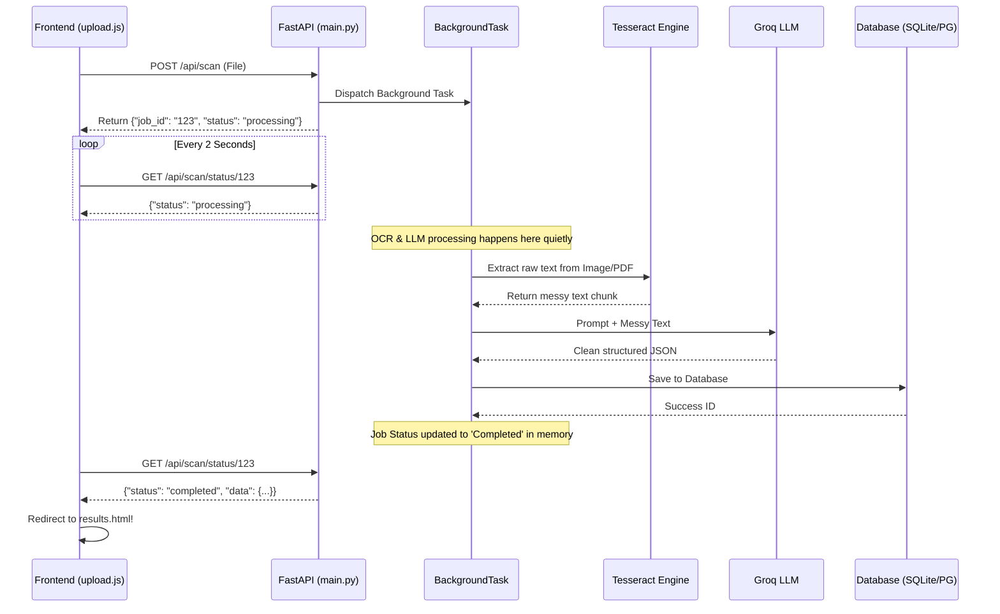

# System Architecture (The Async MVP) 🏗️

This document outlines the high-level architecture of the GST Invoice Scanner following the asynchronous production upgrade.

## The Bottleneck Problem We Solved
Originally, the application utilized a **Synchronous Blocking Architecture**. When User A uploaded a 5MB PDF, FastAPI would freeze the main event loop while it waited for the LLM to read the document. If User B tried to log in at the exact same time, User B's request would hang completely until User A's invoice was finished. This is unacceptable for a production environment.

## The New Asynchronous Blueprint

## Explanation of Key Architectural Choices

### 1. In-Memory Job Tracking (Hackathon Speed)
For tracking the background tasks, we currently use a Python dictionary `scan_jobs = {}` living inside the FastAPI memory. 
**Why?** It requires zero external infrastructure (like Dockerizing Redis). It is blazingly fast and perfect for a hackathon. 
**Tradeoff:** If the FastAPI server crashes or restarts, all currently processing jobs are permanently lost. For enterprise production, `scan_jobs` must be replaced by **Celery & Redis**.

### 2. File Handling
Files are parsed into RAM (`await file.read()`) and passed directly as bytes into the background thread. We do not save physical PDFs temporarily to the hard drive. 
**Why?** It drastically reduces Disk I/O bottlenecks and eliminates the need to write cleanup scripts for orphaned files in a `/tmp/` directory.

### 3. Database Layer Independence
The system is built on **SQLAlchemy ORM**. Currently utilizing SQLite, the application is strictly designed to migrate to **PostgreSQL** (e.g. Supabase or Neon DB) by changing precisely one single string in the `.env` file (`DATABASE_URL`). The object mapping remains unchanged, allowing for instant scalability when SQLite's write-locks become a bottleneck.
