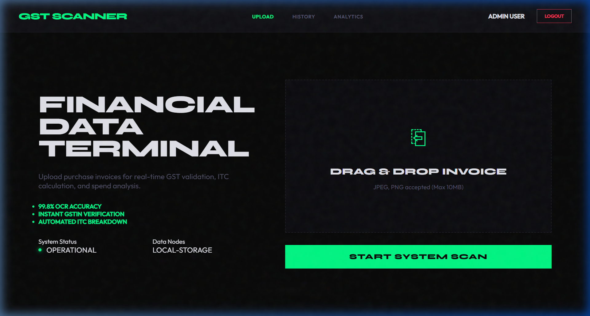
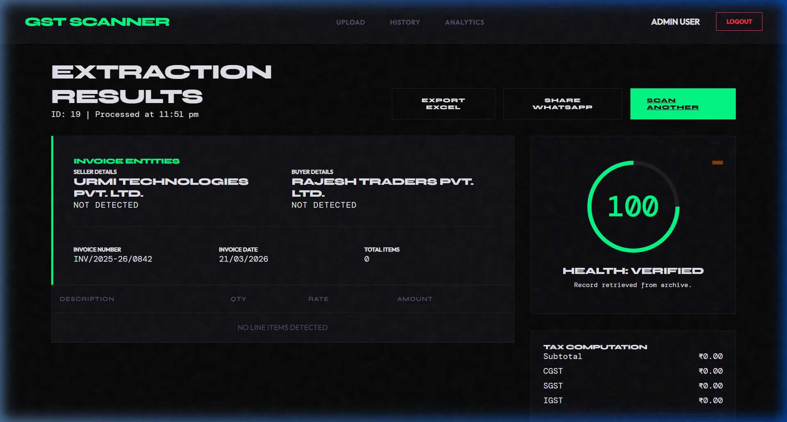
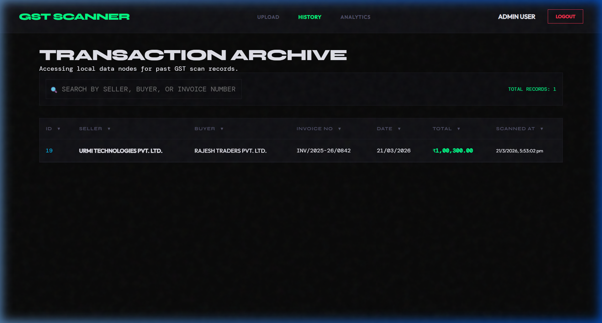
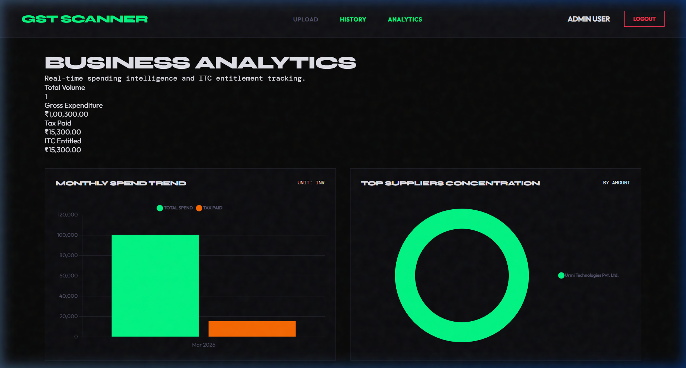

# GST Invoice Scanner

> A professional, AI-powered financial data terminal for scanning, validating, and analyzing GST purchase invoices. Built for Indian small businesses and accountants who need a free, intelligent alternative to expensive tools like ClearTax and Vyapar.


---

## What Problem Does This Solve?

Tools like ClearTax and Vyapar charge businesses **₹5,000–₹20,000/year** for AI invoice scanning and ITC calculation. This project provides the same core features **completely free** — plus a unique **Invoice Health Score** that no competitor offers.

| Feature | ClearTax | Vyapar | This App |
|---|---|---|---|
| AI Invoice Scanning | ✅ Paid | ✅ Paid | ✅ Free |
| Invoice Health Score | ❌ | ❌ | ✅ Free |
| ITC Calculator | ✅ Paid | ✅ Paid | ✅ Free |
| Supplier Analytics | ✅ Paid | ✅ Paid | ✅ Free |
| GST Deadline Tracker | ❌ | ❌ | ✅ Free |
| Excel Export | ✅ Paid | ✅ Paid | ✅ Free |

---

## Live Demo

> **Default Login:** `admin` / `admin123`

---

## Dashboard Gallery

### Secure Access Terminal


### Invoice Processing Hub


### Data Extraction and Health Score


### Transaction Archive


### Business Intelligence Dashboard


---

## Key Features

### 🤖 AI Invoice Scanning
Upload any GST invoice image (JPG/PNG) and Groq's Llama-4-Scout Vision model extracts all data instantly — seller name, buyer name, GSTINs, all line items, CGST, SGST, IGST, and totals.

### 🏥 Invoice Health Score (Unique Feature)
Every scanned invoice gets an automated health score out of 100 with a grade (A–F). The system checks:
- GSTIN format validity (15-character format + valid state code)
- Mathematical accuracy (items × rate = amount, subtotal + tax = total)
- CGST = SGST equality for intrastate transactions
- IGST/CGST conflict detection for interstate invoices
- HSN code presence on all line items
- Invoice date validity (not in future, not older than 1 year)
- Fraud signal detection (round numbers, identical amounts, high-value single items)

### 📊 Supplier Spend Analyzer
Tracks how much your business spends with each supplier over time. Visualized as pie charts and bar charts using Chart.js. Answers "which suppliers am I spending the most with this month?"

### 💰 ITC Calculator
Automatically calculates your Input Tax Credit entitlement for the current month based on all scanned purchase invoices. Shows CGST, SGST, IGST breakdown per supplier with month-over-month comparison.

### 📅 GST Compliance Deadline Tracker
Never miss a GST filing deadline. Shows countdown timers for:
- GSTR-1 → due 11th of every month
- GSTR-3B → due 20th of every month
- GSTR-2B → auto-generated on 14th of every month

### 📁 Invoice History
Complete searchable and sortable database of all past scanned invoices. Filter by seller name, invoice number, or date range.

### 📥 Excel Export
One-click export of any invoice to a formatted Excel file with invoice details, line items table, and tax summary.

### 📱 WhatsApp Share
Share invoice summary directly via WhatsApp with a pre-filled message — useful for sharing with your CA or business partners.

---

## Tech Stack

| Layer | Technology | Purpose |
|---|---|---|
| Frontend | HTML5, CSS3, Vanilla JS | User interface |
| Charts | Chart.js | Analytics visualizations |
| Backend | Python, FastAPI | REST API server |
| AI | Groq API (Llama-4-Scout) | Invoice image reading |
| Database | Neon PostgreSQL | Invoice storage |
| Image Processing | Pillow | Image preprocessing |
| Excel Export | openpyxl | Excel file generation |
| Validation | Custom Python | Health score engine |

---

## System Architecture

```
User uploads invoice image
          ↓
    React frontend (drag & drop)
          ↓
    FastAPI backend (/scan endpoint)
          ↓
    Pillow — image preprocessing
          ↓
    Groq AI (Llama-4-Scout Vision)
          ↓
    JSON extraction (seller, buyer, items, taxes)
          ↓
    validator.py — health score calculation
          ↓
    database.py — save to Neon PostgreSQL
          ↓
    Response returned to frontend
          ↓
    Results page — display + export options
```

---

## API Endpoints

| Method | Endpoint | Description |
|---|---|---|
| GET | `/` | Health check |
| POST | `/scan` | Upload invoice image → AI extracts data + health score |
| POST | `/export` | Invoice JSON → Excel file download |
| GET | `/invoices` | All past scanned invoices |
| GET | `/analytics` | Supplier spend + monthly trends |
| GET | `/itc-summary` | ITC calculator data |

---

## Project Structure

```
gst_invoice_scanner/
├── backend/
│   ├── main.py          → FastAPI app + all API endpoints
│   ├── database.py      → Neon PostgreSQL queries
│   ├── parser.py        → Groq AI invoice reader
│   ├── validator.py     → Invoice health score engine
│   ├── requirements.txt → Python dependencies
│   └── .env             → Secret keys (not in repo)
├── frontend/
│   ├── login.html       → Authentication page
│   ├── register.html    → New user registration
│   ├── index.html       → Invoice upload page
│   ├── results.html     → Scan results + health score
│   ├── history.html     → Past invoices archive
│   ├── analytics.html   → Dashboard + charts + ITC
│   ├── css/
│   │   └── style.css    → Shared styles
│   └── js/
│       ├── auth.js      → Login/logout/session
│       ├── upload.js    → Upload page logic
│       ├── results.js   → Results display logic
│       ├── history.js   → History table logic
│       └── analytics.js → Charts + ITC + deadlines
├── screenshots/         → Dashboard screenshots
├── ARCHITECTURE.md      → Detailed architecture docs
├── PIPELINE.md          → Data pipeline documentation
└── README.md
```

---

## Setup and Installation

### Prerequisites
- Python 3.10+
- A free [Groq API key](https://console.groq.com)
- A free [Neon PostgreSQL](https://neon.tech) database

### 1. Clone the Repository
```bash
git clone https://github.com/VRCHAMPION/gst_invoice_scanner.git
cd gst_invoice_scanner
```

### 2. Install Dependencies
```bash
pip install -r backend/requirements.txt
```

### 3. Create Environment File
Create a `.env` file inside the `backend/` folder:
```
GROQ_API_KEY=your_groq_api_key_here
DATABASE_URL=your_neon_connection_string_here
```

### 4. Create Database Table
Run this SQL in your Neon SQL Editor:
```sql
CREATE TABLE invoices (
    id SERIAL PRIMARY KEY,
    seller_name VARCHAR(255),
    seller_gstin VARCHAR(20),
    buyer_name VARCHAR(255),
    buyer_gstin VARCHAR(20),
    invoice_number VARCHAR(100),
    invoice_date VARCHAR(50),
    cgst DECIMAL(10,2),
    sgst DECIMAL(10,2),
    igst DECIMAL(10,2),
    subtotal DECIMAL(10,2),
    total DECIMAL(10,2),
    items JSONB,
    created_at TIMESTAMP DEFAULT CURRENT_TIMESTAMP
);
```

### 5. Run the Backend
```bash
cd backend
python -m uvicorn main:app --reload
```

Backend runs at: `http://127.0.0.1:8000`

API docs available at: `http://127.0.0.1:8000/docs`

### 6. Open the Frontend
Open `frontend/login.html` in your browser.

**Default Login:** `admin` / `admin123`

---

## Health Score System

The Invoice Health Score is the unique feature of this app. Every invoice is scored out of 100:

| Check | Points Deducted | What It Validates |
|---|---|---|
| Seller GSTIN invalid | -15 | 15-char format + valid state code |
| Buyer GSTIN invalid | -15 | 15-char format + valid state code |
| Math errors | -20 | Items add up, subtotal correct, total correct |
| Invoice date invalid | -10 | Not in future, not older than 1 year |
| HSN codes missing | -10 | All items have HSN codes |
| Fraud signals | -5 each | Round numbers, identical amounts, high-value singles |
| Required fields missing | -5 each | Name, GSTIN, invoice no, date, total |

**Grades:**
- 90–100 → A (Excellent)
- 75–89 → B (Good)
- 60–74 → C (Average)
- 40–59 → D (Poor)
- 0–39 → F (Critical)

---

## Environment Variables

| Variable | Description | Where to Get |
|---|---|---|
| `GROQ_API_KEY` | Groq AI API key | [console.groq.com](https://console.groq.com) |
| `DATABASE_URL` | Neon PostgreSQL connection string | [neon.tech](https://neon.tech) |

---

## Acknowledgements

- [Groq](https://groq.com) — Ultra-fast AI inference API
- [Neon](https://neon.tech) — Serverless PostgreSQL
- [FastAPI](https://fastapi.tiangolo.com) — Modern Python web framework
- [Chart.js](https://chartjs.org) — JavaScript charting library
- [openpyxl](https://openpyxl.readthedocs.io) — Excel file generation

---

## License

MIT License — free to use, modify, and distribute.